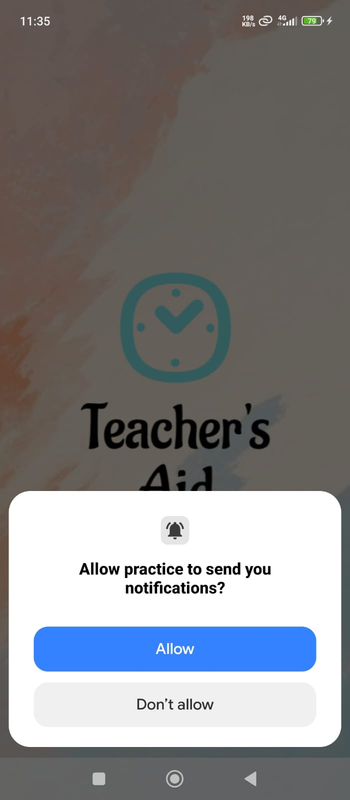
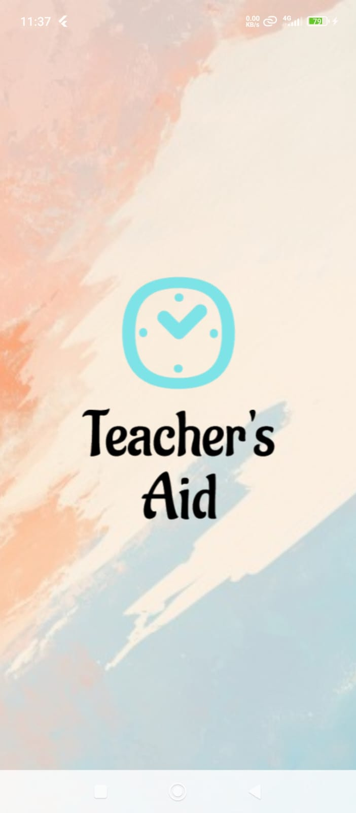
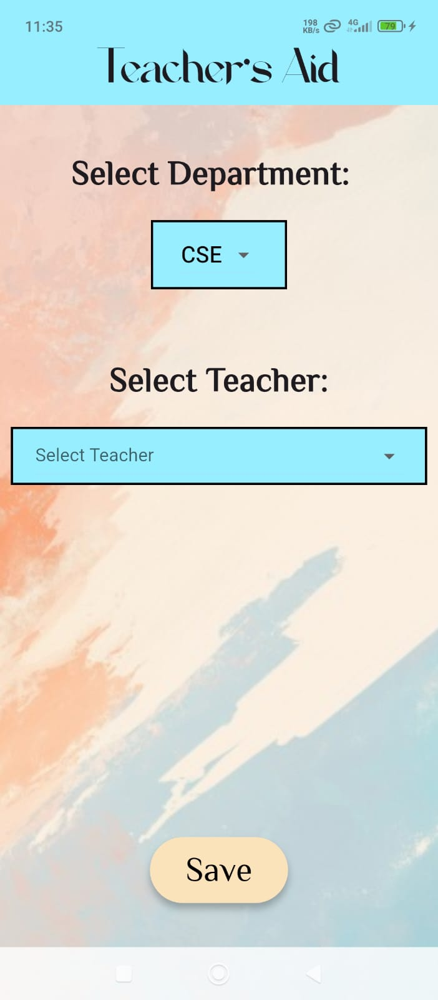
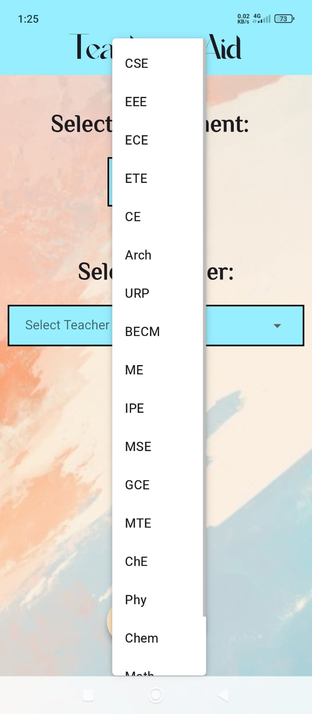
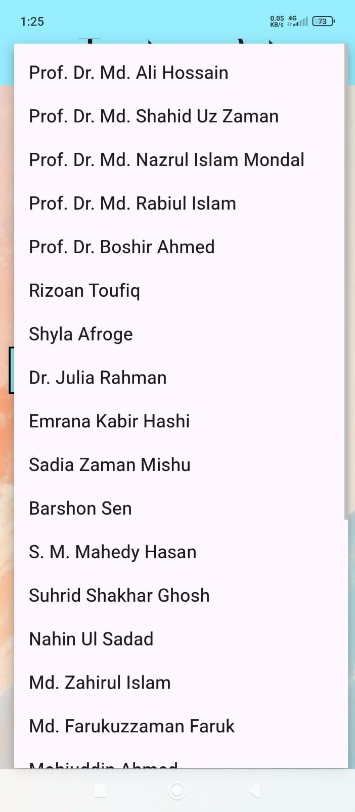
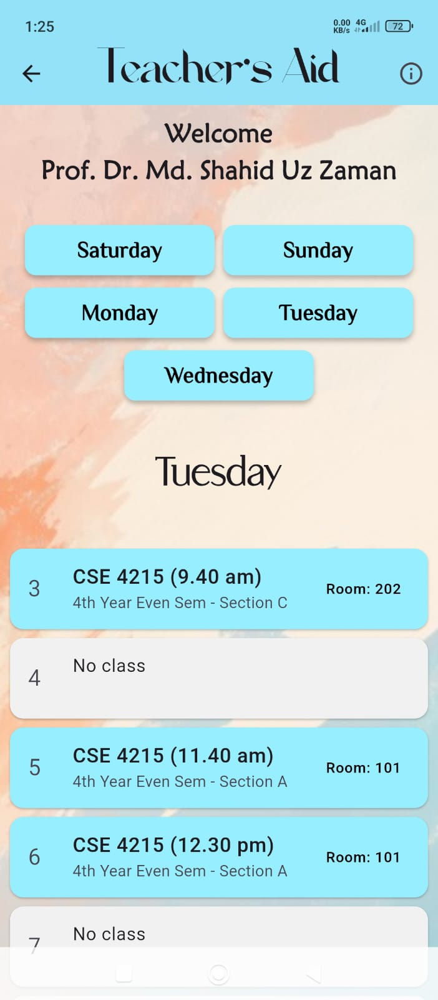
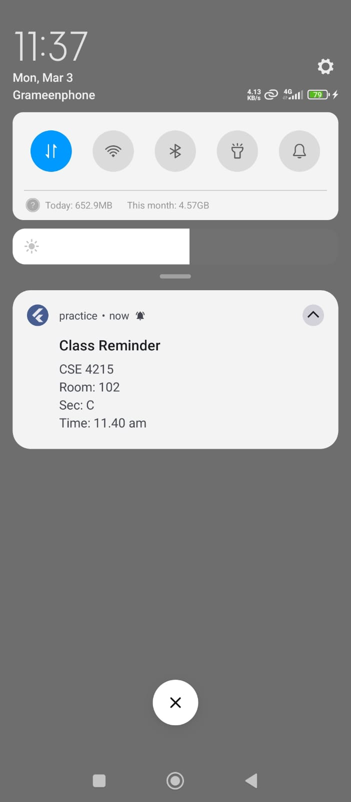
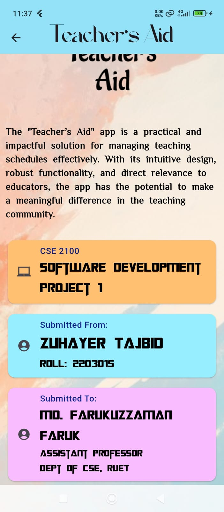

# 📖 Teacher’s Aid

**Teacher’s Aid** is a smart schedule reminder app built with Flutter, designed to help teachers stay on top of their teaching schedule with ease. With timely lock screen notifications and a clean, intuitive UI, it helps educators know what course to teach, where to go, and when to start.

---

# 🚀 Features

🔹 Filter schedule by Department and Teacher code

🔹 View day-wise schedule with periods and class details

🔔 Get notifications and vibrations before each class

🕜 Supports multiple years and sections

🔹 Placeholder for free periods

🎨 Simple and responsive Material UI

---

## 📸 Screenshots

### 📲 Starting Pages

<table>
  <tr>
    <td align="center">
      <br>
      <b>🔐 Initial Permission</b>
    </td>
    <td align="center">
      <br>
      <b>🌊 Splash Screen</b>
    </td>
  </tr>
</table>

---

### 📋 Selection Page

<table>
  <tr>
    <td align="center">
      <br>
      <b>🔍 Selection Page</b>
    </td>
    <td align="center">
      <br>
      <b>🔽 Department Dropdown</b>
    </td>
    <td align="center">
      <br>
      <b>🔽 Teacher Dropdown</b>
    </td>
  </tr>
</table>

---

### 📆 Schedule and Notification

<table>
  <tr>
    <td align="center">
      <br>
      <b>📆 Schedule</b>
    </td>
    <td align="center">
      <br>
      <b>📳 Notification</b>
    </td>
  </tr>
</table>

---

### ℹ️ Info Page

<table>
  <tr>
    <td align="center">
      <br>
      <b>ℹ️ Info Page</b>
    </td>
    <td align="center">
      <br>
      <b>ℹ️ Info Page</b>
    </td>
  </tr>
</table>


---
## 📱 Download APK

👉 [Download the latest APK](https://github.com/Zuhayer-Tajbid/Teacher-s-Aid/releases/tag/v1.0.0)

---


# 🛠️ Tech Stack

- **Flutter** – For cross-platform mobile development

- **Dart** – Primary programming language

- **flutter_local_notifications** – To schedule reminders

- **SharedPreferences / Map** – For lightweight local storage

---
# 📦 Dependencies

```yaml
dependencies:
  flutter:
  flutter_local_notifications: ^9.6.1
  shared_preferences: ^2.2.1

---
# 🙏 Acknowledgements

This app was developed as part of the Software Development Project I course (CSE 2100). The idea was inspired by real-world teaching challenges and aims to improve efficiency in educational institutions.